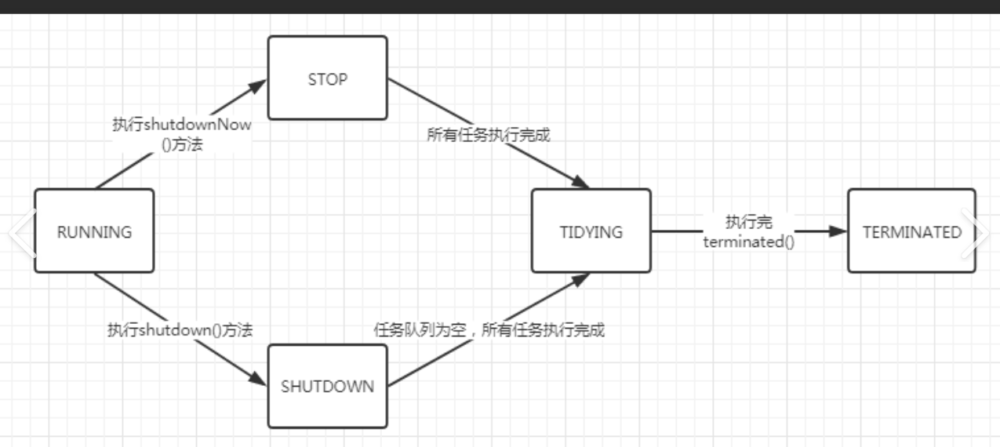

## 一.线程的状态
```
1.新建状态
2.运行状态(就绪和运行)：调用线程的.start方法
    1)就绪，调用start方法，CPU没有分配时间片
    2)运行，调用start方法，CPU正在调度
3.阻塞状态：当竞争`synchornized`锁时，没拿到，线程挂起
4.等待状态: `join`,`wait`,`park`方法
5.超时等待状态：`Thread.sleep(long)`,`wait(long)`,`join(long)`,`parkNanos(...)`
6.死亡状态：`run`方法结束，或者在`run`方法中抛出异常
```

## 二.线程池的核心参数
```java
public ThreadPoolExecutor(
            int corePoolSize,
            int maximumPoolSize, 
            long keepAliveTime,
            TimeUnit unit, 
            BlockingQueue<Runnable> workQueue, 
            ThreadFactory threadFactory,
            RejectedExecutionHandler handler
  )
```
- 为什么不使用`Executors`类提供的创建线程池的方法？
>比如说`newSingleThreadExecutors`,`newFixedThreadPool`默认的线程工厂无法设置线程的名称，分组，优先级，守护状态等属性，另外这些方法也没有提供一种机制来处理在执行过程中抛出的未检查异常。总而言之，提供的控制粒度相对较粗。
## 三.线程池的执行流程
- 1.提交任务到线程池  
    - 如果有空闲 的核心线程。直接执行
    - 如果没有，尝试创建核心线程,去执行任务
- 2.如果已经达到了核心线程数配置
> 将任务扔到任务队列中排队，等待核心线程执行完其他任务再来执行
- 3.如果任务队列满了放不下任务，去构建最大线程数。
- 4.如果最大核心线程数已经构建满了，执行拒绝策略。
### a.什么时候创建核心线程和构建最大线程数
> 核心线程数是无论是否闲置，都保留在线程池的线程。
> 线程数=核心线程数+临时创建线程(临时工)。
> 最大线程数=极限情况下，所能容纳的线程数量。

### b.线程池中的`ctl`属性有什么作用？
用于存储和操作线程池的运行状态和线程数量。
类似于一个工厂大门的显示器和计数器，显示屏显示的是工厂的运行状态，比如正在运行，关闭。
例如
`1011001001001001001001001001001` 前三位`101` 是运行状态。

## 四.线程池的状态

```java
// 1.正常工作状态
    private static final int RUNNING = -536870912;
// 2.从running转到shutdown,不接受新任务，会处理线程池内部现有任务
    private static final int SHUTDOWN = 0;
// 3.从running转到shutdownNow,不接受新任务，会中断线程池内部现有任务
    private static final int STOP = 536870912;
// 4.过渡状态，会从shutdown和stop->TIDYING
// shutdown- 工作队列为空，工作线程为空，TIDYING
// stop - 工作线程为空  TIDYING
// 工作队列：待完成的任务列表
// 工作线程：实际执行任务的线程

    private static final int TIDYING = 1073741824;// 清理资源，准备关闭
    private static final int TERMINATED = 1610612736;
```
### a.工作线程是什么？为什继承AQS?,存在哪里
在线程池中,指的是Worker对象

- 继承AQS的目的是为了添加标识来判断当前工作线程是否可以被打断


### b.在哪些状态会抛出`InterruptedException`?

根据线程的六种状态，不在`RUNNING`状态下，都会抛出`InterruptedException`异常。且此时线程不是`NEW`
,`TERMINTED`状态。剩下`WAITING`,`TIMED_WAITING`,`BLOCKED`状态。或者从三种状态转为`RUNNABLE`状态
- 异常通常用于停止线程。当一个线程抛出这个异常时，它通常需要检查自己是否应该停止运行